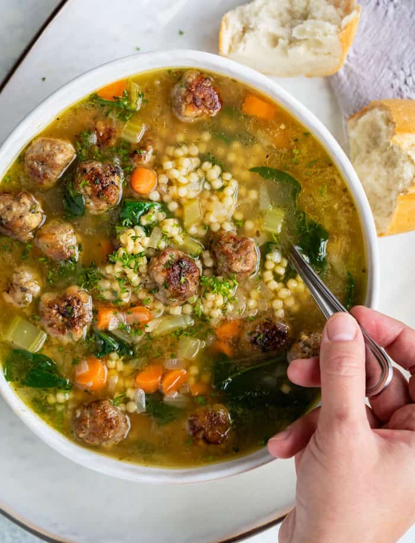

# ENG517-Johnson-ItalianWeddingSoup
practice repo 2

## All About Italian Wedding Soup

### What's In It?
* Pasta - usually either Ditalini or Acini de Pepe. I prefer Ditalini!
* Broth - I see chicken broth used pretty often.
* Mini meatballs - sometimes chicken, sometimes beef, sometimes sausage!
* Chopped veggies - carrots, spinach, yellow onion, celery, garlic, etc.
* Optional: Grated parmesan and/or red pepper flakes! I prefer grated parmesan. 

Note: The name has nothing to do with actual weddings. It comes from a mistranslation and actually refers to the "marriage" of meatballs, broth, pasta and veggies, which is seen as a "gendered" combination in Italy. 

[Read More Here!](https://en.wikipedia.org/wiki/Italian_wedding_soup)

### What Do You Like About It?
1. It's all my favorite foods put together!
2. It's a healthy dish while still tasting incredible!
3. It's easy to make but looks impressive!
4. It makes me sound sophisticated!
5. It's a nice hot dish for cold days in the fall and winter!

[Wanna try it? Start with this recipe!](https://www.thepioneerwoman.com/food-cooking/recipes/a40810110/italian-wedding-soup-recipe/)

### A Photo Of Italian Wedding Soup
